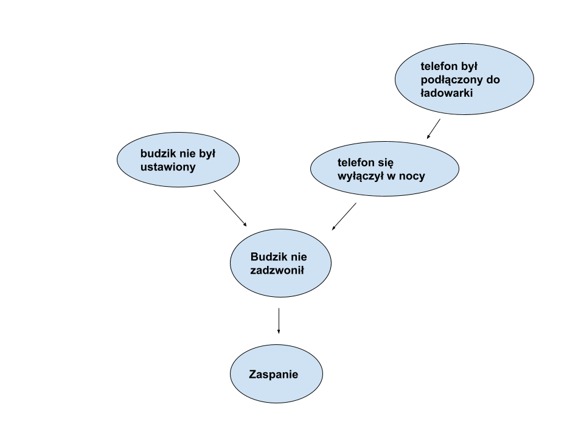

## Modele Bayesowskie
*Stanislau Stankevich*

W ramach ćwiczenie zdefiniowano następujący problem:



Gdzie prawdopodobieństwa:

|       | Budzik był ustawiony |
|-------|----------------------|
| True  | 0.85                 |
| False | 0.15                 |

|       | Telefon był podłączony do ładowarki |
|-------|-------------------------------------|
| True  | 0.7                                 |
| False | 0.3                                 |

| Telefon był podłączony do ładowarki | Telefon się wyłączył (p-stwo) |
|-------------------------------------|-------------------------------|
| True                                | 0.02                          |
| False                               | 0.77                          |

| Budzik był ustawiony | Telefon się wyłączył (p-stwo) | Budzik zadzwonił |
|----------------------|-------------------------------|------------------|
| False                | False                         | 0.001            |
| False                | True                          | 0                |
| True                 | False                         | 0.99             |
| True                 | True                          | 0                |

| Budzik zadzownił | Zaspanie |
|------------------|----------|
| True             | 0.05     |
| False            | 0.86     |

Dane wejściowe są zdefiniowane w pliku `input.py`.

Po zbudowaniu modelu (wyliczeniu wszyskich zależnych prawdopodobieństw), możemy wyprowadzić w konsolę następującą tabelę:
```
         put_on_charge|         alarm_was_set|      phone_turned_off|        alarm_went_off|             oversleep|           probability
_________________________________________________________________________________________________________________________________________
                     0|                     0|                     1|                     1|                     0|                   0.0
_________________________________________________________________________________________________________________________________________
                     0|                     0|                     1|                     1|                     1|                   0.0
_________________________________________________________________________________________________________________________________________
                     0|                     1|                     1|                     1|                     0|                   0.0
_________________________________________________________________________________________________________________________________________
                     0|                     1|                     1|                     1|                     1|                   0.0
_________________________________________________________________________________________________________________________________________
                     1|                     0|                     1|                     1|                     0|                   0.0
_________________________________________________________________________________________________________________________________________
                     1|                     0|                     1|                     1|                     1|                   0.0
_________________________________________________________________________________________________________________________________________
                     1|                     1|                     1|                     1|                     0|                   0.0
_________________________________________________________________________________________________________________________________________
                     1|                     1|                     1|                     1|                     1|                   0.0
_________________________________________________________________________________________________________________________________________
                     0|                     0|                     0|                     1|                     1| 5.175000000000001e-07
_________________________________________________________________________________________________________________________________________
                     1|                     0|                     0|                     1|                     1| 5.145000000000001e-06
_________________________________________________________________________________________________________________________________________
                     0|                     0|                     0|                     1|                     0| 9.832500000000001e-06
_________________________________________________________________________________________________________________________________________
                     0|                     1|                     0|                     0|                     0| 8.211000000000007e-05
_________________________________________________________________________________________________________________________________________
                     1|                     0|                     0|                     1|                     0|            9.7755e-05
_________________________________________________________________________________________________________________________________________
                     1|                     0|                     1|                     0|                     0|0.00029400000000000004
_________________________________________________________________________________________________________________________________________
                     0|                     1|                     0|                     0|                     1| 0.0005043900000000004
_________________________________________________________________________________________________________________________________________
                     1|                     1|                     0|                     0|                     0| 0.0008163400000000007
_________________________________________________________________________________________________________________________________________
                     0|                     0|                     0|                     0|                     0| 0.0014475510000000005
_________________________________________________________________________________________________________________________________________
                     1|                     1|                     1|                     0|                     0|              0.001666
_________________________________________________________________________________________________________________________________________
                     1|                     0|                     1|                     0|                     1| 0.0018060000000000003
_________________________________________________________________________________________________________________________________________
                     0|                     1|                     0|                     1|                     1| 0.0029031749999999996
_________________________________________________________________________________________________________________________________________
                     0|                     0|                     1|                     0|                     0|  0.004851000000000001
_________________________________________________________________________________________________________________________________________
                     1|                     1|                     0|                     0|                     1|  0.005014660000000004
_________________________________________________________________________________________________________________________________________
                     0|                     0|                     0|                     0|                     1|  0.008892099000000002
_________________________________________________________________________________________________________________________________________
                     1|                     1|                     1|                     0|                     1|  0.010233999999999998
_________________________________________________________________________________________________________________________________________
                     1|                     0|                     0|                     0|                     0|  0.014391594000000002
_________________________________________________________________________________________________________________________________________
                     0|                     1|                     1|                     0|                     0|  0.027489000000000003
_________________________________________________________________________________________________________________________________________
                     1|                     1|                     0|                     1|                     1|            0.02886345
_________________________________________________________________________________________________________________________________________
                     0|                     0|                     1|                     0|                     1|  0.029799000000000006
_________________________________________________________________________________________________________________________________________
                     0|                     1|                     0|                     1|                     0|   0.05516032499999999
_________________________________________________________________________________________________________________________________________
                     1|                     0|                     0|                     0|                     1|           0.088405506
_________________________________________________________________________________________________________________________________________
                     0|                     1|                     1|                     0|                     1|   0.16886099999999998
_________________________________________________________________________________________________________________________________________
                     1|                     1|                     0|                     1|                     0|    0.5484055499999999
_________________________________________________________________________________________________________________________________________
```

Jak widać, pierwsze 8 przypadków mają prawdopodobieństwo 0, i ma to sens bo budzik nie może zadzwonić jeżeli telefon się wyłączył w nocy. Najbardziej prawdopodobny na szczęście jest przypadek w którym telefon był podłączony do ładowarki i się nie wyłączył, a więc budzik, który wcześniej był ustawiony, zadzwonił i do zaspania nie doszło.

Jak spróbujemy wygenerować za pomocą stworzonego w pliku `main.py` generatora 10 próbek danych, to zobaczymy następującą (albo podobną do niej) tabele prawdopodobieństwo wystąpienia vs. częstotliwość wystąpienia w danym zestawie próbek:

```
                   sample|              probability|                frequency
_____________________________________________________________________________
                    00110|                      0.0|                      0.0
_____________________________________________________________________________
                    00111|                      0.0|                      0.0
_____________________________________________________________________________
                    01110|                      0.0|                      0.0
_____________________________________________________________________________
                    01111|                      0.0|                      0.0
_____________________________________________________________________________
                    10110|                      0.0|                      0.0
_____________________________________________________________________________
                    10111|                      0.0|                      0.0
_____________________________________________________________________________
                    11110|                      0.0|                      0.0
_____________________________________________________________________________
                    11111|                      0.0|                      0.0
_____________________________________________________________________________
                    00011|    5.175000000000001e-07|                      0.0
_____________________________________________________________________________
                    10011|    5.145000000000001e-06|                      0.0
_____________________________________________________________________________
                    00010|    9.832500000000001e-06|                      0.0
_____________________________________________________________________________
                    01000|    8.211000000000007e-05|                      0.0
_____________________________________________________________________________
                    10010|               9.7755e-05|                      0.0
_____________________________________________________________________________
                    10100|   0.00029400000000000004|                      0.0
_____________________________________________________________________________
                    01001|    0.0005043900000000004|                      0.0
_____________________________________________________________________________
                    11000|    0.0008163400000000007|                      0.0
_____________________________________________________________________________
                    00000|    0.0014475510000000005|                      0.0
_____________________________________________________________________________
                    11100|                 0.001666|                      0.0
_____________________________________________________________________________
                    10101|    0.0018060000000000003|                      0.0
_____________________________________________________________________________
                    01011|    0.0029031749999999996|                      0.0
_____________________________________________________________________________
                    00100|     0.004851000000000001|                      0.0
_____________________________________________________________________________
                    11001|     0.005014660000000004|                      0.0
_____________________________________________________________________________
                    00001|     0.008892099000000002|                      0.0
_____________________________________________________________________________
                    11101|     0.010233999999999998|                      0.0
_____________________________________________________________________________
                    10000|     0.014391594000000002|                      0.0
_____________________________________________________________________________
                    01100|     0.027489000000000003|                      0.0
_____________________________________________________________________________
                    11011|               0.02886345|                      0.0
_____________________________________________________________________________
                    00101|     0.029799000000000006|                      0.0
_____________________________________________________________________________
                    01010|      0.05516032499999999|                      0.0
_____________________________________________________________________________
                    10001|              0.088405506|                      0.0
_____________________________________________________________________________
                    01101|      0.16886099999999998|                      0.3
_____________________________________________________________________________
                    11010|       0.5484055499999999|                      0.7
_____________________________________________________________________________
```

Jak widać z tabeli 7 z 10 próbek trafiły na najprawdopodniejszą opcję i jeszcze 3 na drugą.
Częstotliwości wystąpienia słabo, ale korelują z prawdopodobieństwami.

Zwiększając ilość próbek do 100:

```
                   sample|              probability|                frequency
_____________________________________________________________________________
                    00110|                      0.0|                      0.0
_____________________________________________________________________________
                    00111|                      0.0|                      0.0
_____________________________________________________________________________
                    01110|                      0.0|                      0.0
_____________________________________________________________________________
                    01111|                      0.0|                      0.0
_____________________________________________________________________________
                    10110|                      0.0|                      0.0
_____________________________________________________________________________
                    10111|                      0.0|                      0.0
_____________________________________________________________________________
                    11110|                      0.0|                      0.0
_____________________________________________________________________________
                    11111|                      0.0|                      0.0
_____________________________________________________________________________
                    00011|    5.175000000000001e-07|                      0.0
_____________________________________________________________________________
                    10011|    5.145000000000001e-06|                      0.0
_____________________________________________________________________________
                    00010|    9.832500000000001e-06|                      0.0
_____________________________________________________________________________
                    01000|    8.211000000000007e-05|                      0.0
_____________________________________________________________________________
                    10010|               9.7755e-05|                      0.0
_____________________________________________________________________________
                    10100|   0.00029400000000000004|                      0.0
_____________________________________________________________________________
                    01001|    0.0005043900000000004|                      0.0
_____________________________________________________________________________
                    11000|    0.0008163400000000007|                      0.0
_____________________________________________________________________________
                    00000|    0.0014475510000000005|                      0.0
_____________________________________________________________________________
                    11100|                 0.001666|                      0.0
_____________________________________________________________________________
                    10101|    0.0018060000000000003|                      0.0
_____________________________________________________________________________
                    01011|    0.0029031749999999996|                      0.0
_____________________________________________________________________________
                    00100|     0.004851000000000001|                     0.02
_____________________________________________________________________________
                    11001|     0.005014660000000004|                     0.01
_____________________________________________________________________________
                    00001|     0.008892099000000002|                      0.0
_____________________________________________________________________________
                    11101|     0.010233999999999998|                      0.0
_____________________________________________________________________________
                    10000|     0.014391594000000002|                     0.02
_____________________________________________________________________________
                    01100|     0.027489000000000003|                      0.0
_____________________________________________________________________________
                    11011|               0.02886345|                     0.03
_____________________________________________________________________________
                    00101|     0.029799000000000006|                     0.06
_____________________________________________________________________________
                    01010|      0.05516032499999999|                     0.06
_____________________________________________________________________________
                    10001|              0.088405506|                     0.08
_____________________________________________________________________________
                    01101|      0.16886099999999998|                      0.2
_____________________________________________________________________________
                    11010|       0.5484055499999999|                     0.52
_____________________________________________________________________________
```

Widzimy ze zaczęły występować mniej prawdopodobne opcje.

Zwiększając do 10000:

```
                   sample|              probability|                frequency
_____________________________________________________________________________
                    00110|                      0.0|                      0.0
_____________________________________________________________________________
                    00111|                      0.0|                      0.0
_____________________________________________________________________________
                    01110|                      0.0|                      0.0
_____________________________________________________________________________
                    01111|                      0.0|                      0.0
_____________________________________________________________________________
                    10110|                      0.0|                      0.0
_____________________________________________________________________________
                    10111|                      0.0|                      0.0
_____________________________________________________________________________
                    11110|                      0.0|                      0.0
_____________________________________________________________________________
                    11111|                      0.0|                      0.0
_____________________________________________________________________________
                    00011|    5.175000000000001e-07|                      0.0
_____________________________________________________________________________
                    10011|    5.145000000000001e-06|                    1e-05
_____________________________________________________________________________
                    00010|    9.832500000000001e-06|                      0.0
_____________________________________________________________________________
                    01000|    8.211000000000007e-05|                  0.00011
_____________________________________________________________________________
                    10010|               9.7755e-05|                   0.0001
_____________________________________________________________________________
                    10100|   0.00029400000000000004|                  0.00036
_____________________________________________________________________________
                    01001|    0.0005043900000000004|                  0.00045
_____________________________________________________________________________
                    11000|    0.0008163400000000007|                  0.00095
_____________________________________________________________________________
                    00000|    0.0014475510000000005|                  0.00142
_____________________________________________________________________________
                    11100|                 0.001666|                   0.0016
_____________________________________________________________________________
                    10101|    0.0018060000000000003|                  0.00171
_____________________________________________________________________________
                    01011|    0.0029031749999999996|                  0.00293
_____________________________________________________________________________
                    00100|     0.004851000000000001|                  0.00512
_____________________________________________________________________________
                    11001|     0.005014660000000004|                  0.00494
_____________________________________________________________________________
                    00001|     0.008892099000000002|                  0.00857
_____________________________________________________________________________
                    11101|     0.010233999999999998|                  0.01037
_____________________________________________________________________________
                    10000|     0.014391594000000002|                  0.01448
_____________________________________________________________________________
                    01100|     0.027489000000000003|                  0.02674
_____________________________________________________________________________
                    11011|               0.02886345|                  0.02931
_____________________________________________________________________________
                    00101|     0.029799000000000006|                  0.03001
_____________________________________________________________________________
                    01010|      0.05516032499999999|                  0.05544
_____________________________________________________________________________
                    10001|              0.088405506|                  0.08936
_____________________________________________________________________________
                    01101|      0.16886099999999998|                  0.16977
_____________________________________________________________________________
                    11010|       0.5484055499999999|                  0.54625
_____________________________________________________________________________
```

Rezultat jest spodziewany. Czyli model jest poprawnie zbudowany.
